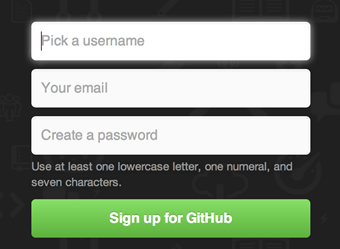
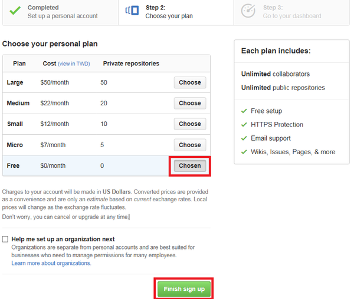
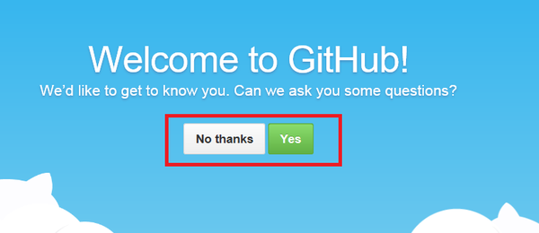
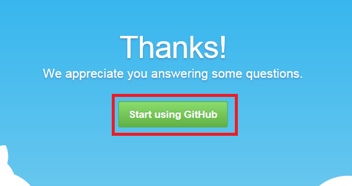
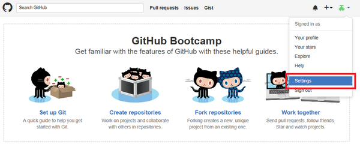
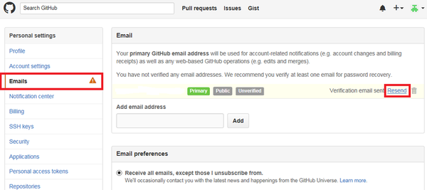

\ |STYLE0|\ 

申請方式如下：

1. 使用瀏覽器連到\ |LINK1|\ 

2. 輸入帳號、Email與密碼，然後按Sign Up for Github按鈕

   \ |IMG1|\ 

3. 選擇付費方式，在本案中使用Free的帳號就好，然後按Finish sign up按鈕

   \ |IMG2|\ 

4. 接著會問你一些問題，你可以選擇回答或不回答

   \ |IMG3|\     

5. 如果有回答則會出現下方的畫面，然後按下Start using GitHub

   \ |IMG4|\ 

6. 接著點選右上方的大頭貼，選擇Settings

   \ |IMG5|\ 

7. 點選左側選單中的Emails，然後點選右側Resend按鈕，發送帳號驗證Email

   \ |IMG6|\ 

8. 到Email信箱收驗證信件，點選帳號驗證連結後，再回到本頁。如果沒有出現unverified，就表示帳號驗證成功囉!

.. bottom of content

.. |STYLE0| replace:: **Github帳號申請**

.. |LINK1| raw:: html

    <a href="https://github.com/" target="_blank">Github官方網站</a>

