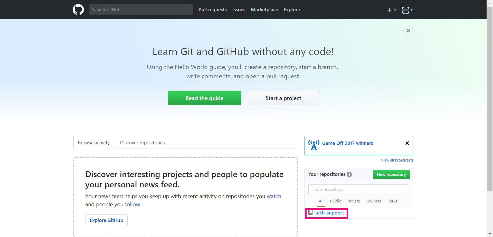
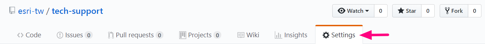
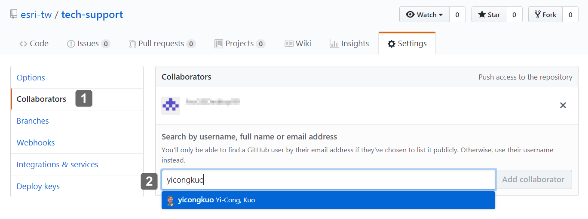
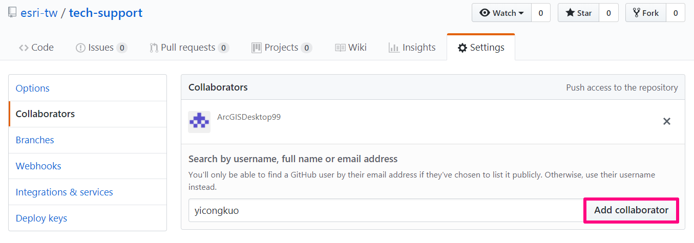
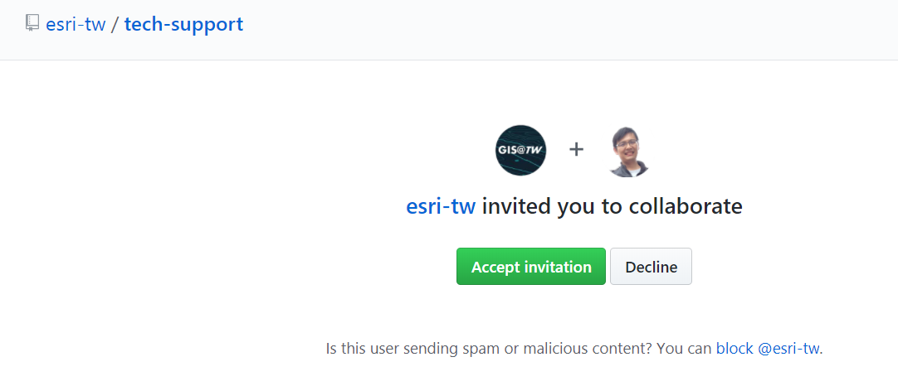

\ |STYLE0|\ 

加入Github專案協作方式如下：

* \ |STYLE1|\ 

* \ |STYLE2|\ 

    1. \ |STYLE3|\ \ |LINK1|\ 

    2. \ |STYLE4|\  \ |LINK2|\ 

        \ |IMG1|\ 

    3. \ |STYLE5|\ 

        \ |IMG2|\ 

    4. \ |STYLE6|\ 

        \ |IMG3|\     

    5. \ |STYLE7|\ 

        \ |IMG4|\ 
        
    6. \ |STYLE8|\ 

        \ |IMG5|\ 

    7. \ |STYLE9|\  
        
        \ |IMG6|\    

.. bottom of content

.. |STYLE0| replace:: **加入Github 專案協作行列**

.. |STYLE1| replace:: **當新成員建好Github帳號後，將帳號或Eamil告知專案管理員**

.. |STYLE2| replace:: **專案管理到Github專案後台加入新成員**

.. |STYLE3| replace:: **登入**

.. |STYLE4| replace:: **進入專案儲存庫，本案儲存庫是**

.. |STYLE5| replace:: **切換到Settings分頁**

.. |STYLE6| replace:: **點選左側選單中的Collaborators，然後在右側搜尋列中輸入新成員帳號或Email，找到新成員**

.. |STYLE7| replace:: **點選Add collaborator按鈕，取得邀請連結**

.. |STYLE8| replace:: **將邀請連結給新成員**

.. |STYLE9| replace:: **新成員點選邀請連結後，按Accept invitation按鈕，即可完成加入協作行列**

.. |LINK1| raw:: html

    <a href="https://github.com/" target="_blank">Github</a>

.. |LINK2| raw:: html

    <a href="https://github.com/esri-tw/tech-support" target="_blank">tech-support</a>

.. |IMG5| image:: static/加入Github_專案共筆行列_5.png
   :height: 181 px
   :width: 432 px

