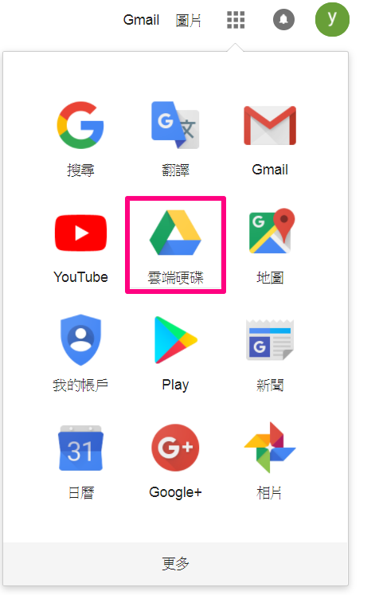
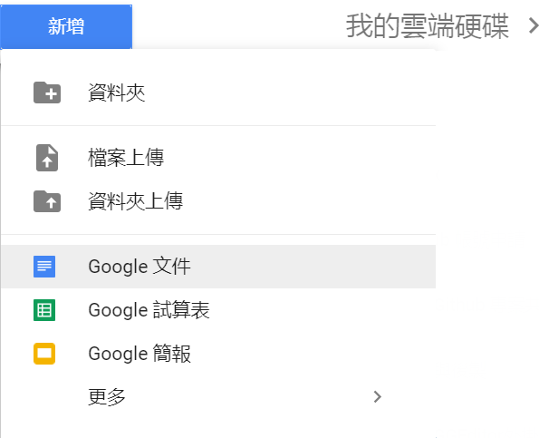
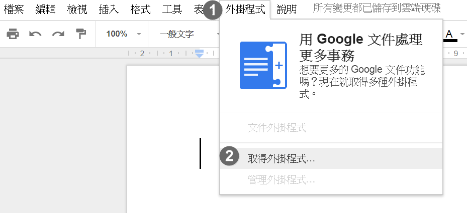
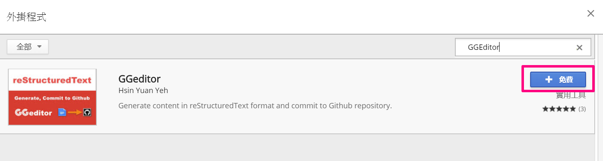
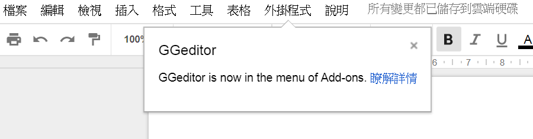

.. _h367b16543e4083ab15633832817:

安裝GGEditor外掛程式
********************

安裝步驟如下：

1. 登入Google

2. 點選大頭貼旁邊的應用程式按鈕，選擇\ |STYLE0|\ 

   \ |IMG1|\ 

3. 進到雲端硬碟後，點選左上角的\ |STYLE1|\ 按鈕，在點選\ |STYLE2|\ 

   \ |IMG2|\ 

4. 在Google中，點選上方工具列的\ |STYLE3|\ 按鈕，選擇\ |STYLE4|\ 

   \ |IMG3|\ 

5. 在搜尋列中輸入 \ |STYLE5|\ ，然後按Enter

6. 在GGEditor項目右邊，點選 \ |STYLE6|\  按鈕安裝GGEditor外掛程式

   \ |IMG4|\ 

7. 安裝完成

   \ |IMG5|\ 

.. bottom of content

.. |STYLE0| replace:: **Google雲端硬碟**

.. |STYLE1| replace:: **新增**

.. |STYLE2| replace:: **Google文件**

.. |STYLE3| replace:: **外掛程式**

.. |STYLE4| replace:: **取得外掛程式**

.. |STYLE5| replace:: **GGEditor**

.. |STYLE6| replace:: **+免費**

