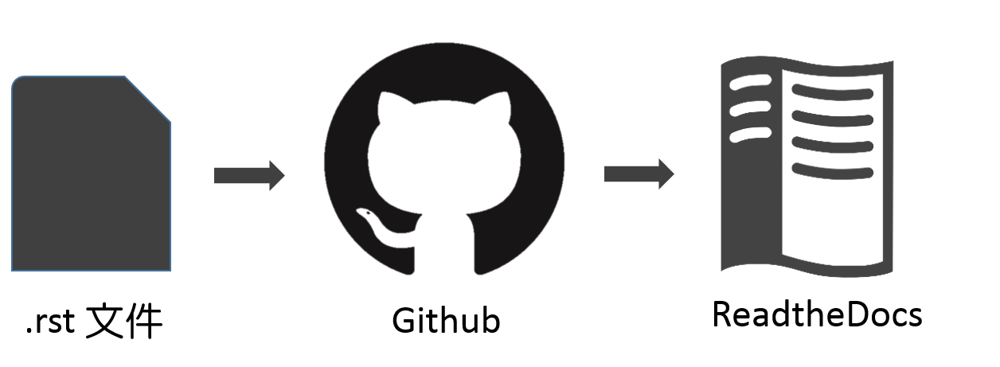

.. _h3e3d5f6a62764b2c83764516e6f638:

Tech-Support 文件共筆需要你
***************************

在公司打拼的您，是否有過以下經驗?

#. 遇到問題卻沒人可問，或不敢問?

#. Help有時又長又分散，很難跟著做?

#. 英文看不懂，只好放棄?

#. 問題解決了，但不知道怎麼分享解方式?

#. 解決過的問題，下次遇到時，又要找很久才能解決?

如果上述情況您經常遇到，請加入我們的行列，一起打造美好的中文查詢系統(Orz)，讓未來的您萬事皆可達，變有錢爸媽(\*￣▽￣)/‧☆\*"`'*-.,_,.-*'`"\*-.,_☆)!

.. _h2164242e4c6048506f23311549231654:

共筆工具介紹
------------

市面上文件共筆方案有很多，但完成的文件可以兼具美觀、好瀏覽，又具備全文檢索功能的工具卻不多。本篇要介紹的共筆方式，是使用\ |LINK1|\ 網站作為文件管理系統，文件成果為響應式網頁，不同裝置在閱讀上都能有良好的體驗。\ |LINK2|\ 還可以使用\ |STYLE0|\ ，方便閱讀者查詢相關文章，是網路文件服務的好選擇。

\ |LINK3|\ 網站使用\ |LINK4|\  (.rst) 格式文件作為來源文件，文件經過網站內建程式自動轉換後，就會成為美觀的網頁，並具有全文查詢功能。

實務上，我們會把做好的\ |LINK5|\ ucturedText (.rst) 文件存放在\ |LINK6|\ 上，然後\ |LINK7|\ 網站自動偵測\ |LINK8|\ 網站上文件異動狀況。一有異動，\ |LINK9|\ 就立刻重新製作成果網頁，因此\ |STYLE1|\ 

#. \ |STYLE2|\ 

#. \ |STYLE3|\ 

\ |IMG1|\ 

.. _h71416946633d55145e4674d44312b38:

reStructuredText (.rst) 文件製作方式
------------------------------------

由於\ |LINK10|\ 使用\ |LINK11|\ 格式文件作為來源文件，因此在文件製作上有以下幾種方式：

#. 直接撰寫reStructuredText文件

#. 使用\ |LINK12|\ 編輯內容，再轉檔成reStructuredText格式

#. 使用Word編輯內容，再轉檔成reStructuredText格式

.. _h7ffe637735a477c38426554593d25:

Github使用方式
--------------

編輯好的reStructuredText文件要推送到Github上，ReadtheDocs才能偵測文件異動狀況。推送文件到Github上有幾種方便的方式：

#. 使用Github for Desktop進行推送

#. 使用GGEditor進行推送

.. _h174fb648377959437b5c1f697c1c40:

共筆流程
--------

統整一下\ |LINK13|\ 與\ |LINK14|\ 兩節的內容，筆者歸納出以下三種共筆方式供您參考：

+----+--------------+--------+------------------+------+
|方式|編輯工具      |轉檔工具|Github推送工具    |難易度|
+----+--------------+--------+------------------+------+
|1   |文字編輯器    |無      |Github for Desktop|難    |
|    |              |        |                  |      |
|    |- Sublime Text|        |                  |      |
|    |              |        |                  |      |
|    |- Notepad++   |        |                  |      |
+----+--------------+--------+------------------+------+
|2   |Google 文件   |GGEditor|GGEditor          |簡單  |
+----+--------------+--------+------------------+------+
|3   |Word          |Pandoc  |Github for Desktop|中等  |
+----+--------------+--------+------------------+------+

三種共筆方式的完整步驟，可以參考以下文件。筆者推薦各位使用第2種Google文件共筆方式，讓您省時又省力!

.. toctree:: 
    :maxdepth: 2
    :glob:

    GoogleDoc/index

.. bottom of content

.. |STYLE0| replace:: **中文全文檢索**

.. |STYLE1| replace:: **文件製作人員只需要專心做兩件事：**

.. |STYLE2| replace:: **編輯文件內容**

.. |STYLE3| replace:: **將文件推送到Github上**

.. |LINK1| raw:: html

    <a href="https://readthedocs.org/" target="_blank">ReadtheDocs</a>

.. |LINK2| raw:: html

    <a href="https://readthedocs.org/" target="_blank">ReadtheDocs</a>

.. |LINK3| raw:: html

    <a href="https://readthedocs.org/" target="_blank">ReadtheDocs</a>

.. |LINK4| raw:: html

    <a href="https://zh.wikipedia.org/wiki/ReStructuredText" target="_blank">reStructuredText</a>

.. |LINK5| raw:: html

    <a href="https://zh.wikipedia.org/wiki/ReStructuredText" target="_blank">reStr</a>

.. |LINK6| raw:: html

    <a href="https://github.com" target="_blank">Github網站</a>

.. |LINK7| raw:: html

    <a href="https://readthedocs.org/" target="_blank">ReadtheDocs</a>

.. |LINK8| raw:: html

    <a href="https://github.com" target="_blank">Github</a>

.. |LINK9| raw:: html

    <a href="https://readthedocs.org/" target="_blank">ReadtheDocs</a>

.. |LINK10| raw:: html

    <a href="https://readthedocs.org/" target="_blank">ReadtheDocs</a>

.. |LINK11| raw:: html

    <a href="https://zh.wikipedia.org/wiki/ReStructuredText" target="_blank">reStructuredText</a>

.. |LINK12| raw:: html

    <a href="https://www.google.com.tw/intl/zh-TW/docs/about/" target="_blank">Google文件</a>

.. |LINK13| raw:: html

    <a href="#heading=h.jz2yt3nvl9mz">reStructuredText (.rst) 文件製作方式</a>

.. |LINK14| raw:: html

    <a href="#heading=h.6hl9smb7xp1t">Github使用方式</a>

